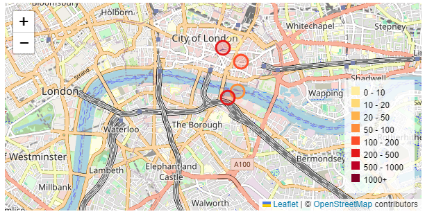

# Custom Legend

An example code below shows the way with old-version Leaflet & React leaflet

[How to add a legend to the map using react leaflet? - CodeSandbox](https://codesandbox.io/s/how-to-add-a-legend-to-the-map-using-react-leaflet-6yqs5?file=/package.json)

This directory contains an example code for newer-versions of Leaflet

